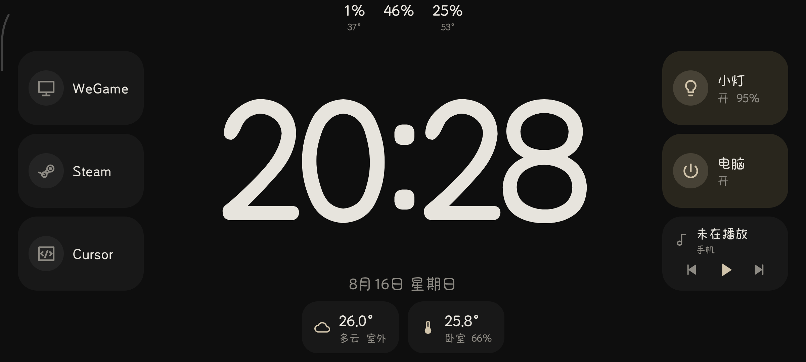

# Dock

横屏常亮的安卓工位屏。一块旧手机横过来当台钟：看时间、看电脑占用、看室内外温度；点 logo 在电脑上打开白名单程序，点开关控制米家灯和插座，播放键管手机自己正在播的歌。

电脑上跑 Python Hub，手机只在局域网里用 HTTP 说话。米家登录、设备 id、可执行路径都留在电脑上，安卓看不到，也发不出任意命令。



```
手机 Dock App  ── LAN HTTP :17890 ──►  Windows Hub
                                      ├─ 米家（mijia-api）
                                      ├─ 本机启动白名单
                                      └─ CPU / 内存 / GPU
```

默认 `http://<电脑局域网IP>:17890`，共享 Bearer token。

## 仓库

| 目录 | 说明 |
|------|------|
| [android/](android/) | 安卓客户端（Kotlin + Jetpack Compose） |
| [hub/](hub/README.md) | Windows Python Hub（托盘 / 可打 exe） |
| [docs/](docs/) | 局域网协议。改接口先改文档再改两边实现 |

协议：

- [docs/lan-protocol.md](docs/lan-protocol.md) — 说明、时序、验收
- [docs/openapi.yaml](docs/openapi.yaml) — OpenAPI 3

## 1. Windows Hub

完整说明见 [hub/README.md](hub/README.md)。需要 Windows 10/11、Python 3.10+（推荐 [uv](https://github.com/astral-sh/uv)），防火墙放行入站 TCP **17890**。CPU 温度需要 [PawnIO](https://github.com/namazso/PawnIO) 并以管理员运行。

**推荐：打成 exe，管理员运行（系统托盘）：**

```powershell
cd hub
powershell -ExecutionPolicy Bypass -File .\build-exe.ps1
# 右键 dist\DockHub.exe → 以管理员身份运行
```

**源码：**

```powershell
cd hub
uv sync
uv run dock-hub --init
uv run dock-hub --list-devices
uv run dock-hub
```

首次启动会打印二维码，用米家 App 扫码。配置在 `%USERPROFILE%\.config\dock-hub\hub.yaml`（`--init` 会生成随机 token）。示例见 [hub/hub.yaml.example](hub/hub.yaml.example)。

把启动日志里的局域网 IP、端口 `17890`、以及 yaml 里的 `token` 填进安卓。

## 2. 安卓

横屏 kiosk。点时钟上方的 **CPU / MEM / GPU** 打开设置页，填写 Hub 的地址、端口、token，再点「测试连接」。

长按右侧音乐卡可打开系统「通知使用权」（用来显示正在播放的歌名）。播放键控制的是手机本机媒体，不经过 Hub。

用 Android Studio 打开 `android/`，或：

```bash
cd android
./gradlew :app:assembleDebug
```

包名 `cn.weiekko.dock`，最低 Android 8.0（API 26）。

## 许可

Hub 依赖 [mijia-api](https://github.com/Do1e/mijia-api)（GPL-3.0）。自用没问题；若分发 Hub，需要同样以 GPL-3.0 开源。
