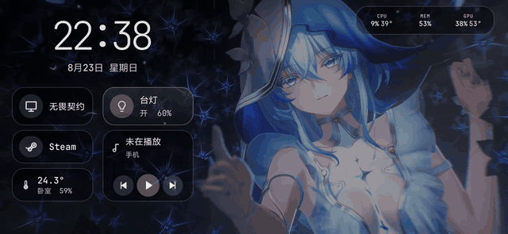

# 岸亭（Shoreting）

守岸人在漂泊者书桌上值班。横屏安卓是亭子的脸和字幕，Windows Hub 当门口，Mac Mini 跑模型并在本机喇叭说话。亭里还能看天气与室内温湿度、电脑监控，控制米家设备，一键启动电脑上的白名单程序。

当前安卓 **0.3.7**。权威仓库在 Mac：`/Users/weiekko/dock/`，remote `git@github.com:wxydejoy/Helm.git`，分支 `main`。



手机只通过局域网 HTTP 与 Hub 通信，不直连米家、Ollama 或 TTS。协议是两边的唯一契约：

- [docs/companion.md](docs/companion.md) — **先读这个**：三台怎么接、怎么启动、听完 / 边写边念 / 打断、常见填反
- [docs/lan-protocol.md](docs/lan-protocol.md) — HTTP 说明、时序、验收
- [docs/openapi.yaml](docs/openapi.yaml) — OpenAPI 3

下面 IP 是**本宅当前地址**，换家请改。Hub `http://10.83.22.31:17890`（Windows，Bearer token）。Mac Mini 监控另开 `http://10.83.22.121:17891`（不是 Hub）。脑和嘴在 Mini：Ollama `:11434`，TTS `:18100 --play`。

## 仓库结构

| 目录 | 说明 |
|------|------|
| [android/](android/README.md) | 安卓客户端（Kotlin / Jetpack Compose） |
| [hub/](hub/README.md) | Windows Hub（米家 + 本机启动 + PC 监控 + 托盘 exe + 伴侣转发） |
| [mini/](mini/README.md) | Mac Mini 本机 CPU / 内存 / GPU（`:17891`，不是 Hub、不是 TTS） |
| [companion/tts/](companion/tts/README.md) | Mini 守岸人 TTS（`:18100 --play`） |
| [docs/](docs/) | 局域网协议与守岸人说明（改接口先改文档） |

## 安卓（客户端）

横屏全屏摆件，未配置 Hub 时进入**预览模式**（本地演示数据）。构建见 [android/README.md](android/README.md)。

### 主屏

- 大时钟 + 中文日期（多种字体与字号）
- **PC 监控条**：第一行 Windows CPU / 内存 / GPU / FPS，第二行 Mac Mini CPU / 内存 / GPU（约 3s 刷新）— 点击进入设置
- **左侧**：最多 3 个 Windows 应用快捷启动（Remix 图标）
- **右侧**：米家灯/开关 + **手机媒体控制**（上一首 / 播放暂停 / 下一首）
- **底部**：室外天气 + 室内温湿度
- 可选**视频背景**（循环静音）；方块样式（磨砂 / 深色 / 实心 / 细线）与透明度可调
- **语音唤醒**：说「岸宝」听你说话；听完约 2.5s 后发给 Hub。字幕显示全文；Mini 在第一句写出后就开始念。她正在说时再喊「岸宝」会打断并停播
- **主屏编排**：长按模块可拖动、缩放；可隐藏模块或去掉背景边框

### 设置

- Hub：**地址 / 端口 / Token**。填 Windows `10.83.22.31`、`17890`，不要填 Mini 的 IP
- Mac Mini：**默认地址 `10.83.22.121:17891`，默认 Token 已填**
- 视频背景：选择 / 更换 / 清除本地视频
- 方块样式与字体排版预览
- **插电亮屏、拔电熄屏**（需设备管理员，仅用于 `lockNow()`）
- 媒体控制需开启**通知使用权**

### 构建

```bash
cd android
./fetch-wake-word.sh   # 首次：下载「岸宝」唤醒词模型
./gradlew :app:assembleDebug
```

安装后首次打开为预览；在设置页填入 Hub 的 IP、`17890`、token 即可联机。

单元测试：

```bash
./gradlew :app:testDebugUnitTest
```

## Windows Hub（服务端）

完整说明见 [hub/README.md](hub/README.md)。

**推荐：打包 exe，管理员运行（托盘图标 + 米家重新登录）**

```powershell
cd hub
powershell -ExecutionPolicy Bypass -File .\build-exe.ps1
# 右键 dist\DockHub.exe → 以管理员身份运行
```

**源码开发：**

```powershell
cd hub
uv sync
uv run dock-hub --init
uv run dock-hub --list-devices
uv run dock-hub
uv run dock-hub --login    # 米家过期时重新扫码
```

配置：`%USERPROFILE%\.config\dock-hub\hub.yaml`（token、设备白名单、本机程序路径）。

防火墙放行入站 **TCP 17890**；CPU 温度需 **PawnIO**（可选，见 [hub/README.md](hub/README.md#pawnio-cpu-温度可选)）+ 管理员权限。

## 联机速查

完整顺序和排错见 [docs/companion.md](docs/companion.md)。

1. Windows 启动 Hub，记下局域网 IP（本宅 **`10.83.22.31`**）与 `hub.yaml` 里的 token（不要把 token 写进 git）
2. 安卓设置页 **Hub** 填该 IP、端口 `17890`、token，点测试连接（不要填 Mini `10.83.22.121`）
3. Mini 上启动 Ollama 与 [companion/tts](companion/tts/README.md) `--play`；Hub 的 `companion.llm` / `tts` 指向 Mini
4. 安卓 **Mini** 栏填 `10.83.22.121:17891`（只给主屏 CPU 第二行）
5. 米家设备名在 Hub 侧用 `uv run dock-hub --list-devices` 核对

## 许可

- Hub 依赖 [mijia-api](https://github.com/Do1e/mijia-api)（GPL-3.0）；分发 Hub 需同样开源
- 安卓内置字体见 `android/app/src/main/assets/font-licenses/`（OFL）
