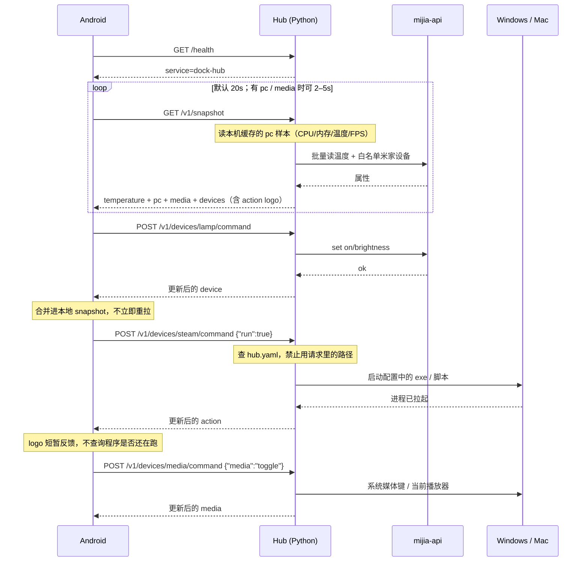

# Dock LAN Protocol v1

安卓摆件 App 与电脑上 Python Hub 的局域网通信契约。

- **安卓**：只实现本文档的客户端。不直连米家，不理解 `did` / `siid` / `piid`，也不知道电脑上要跑哪条命令；电脑性能数字只读 snapshot 里的 `pc`。
- **Hub**（另一名 agent 编写）：在 Mac / Windows 上跑一个简单 Python 脚本，对内调 [mijia-api](https://github.com/Do1e/mijia-api)、采集本机性能、按白名单启动本机程序，对外只暴露本文档的 3 个 HTTP 接口。

本文档是唯一协议来源。机器可读副本见 [openapi.yaml](./openapi.yaml)。

---

## 1. 目标与边界

首版做五件事：

1. 显示一个温度（可选湿度）
2. 控制少数几个已配置的米家设备（开关 / 灯）
3. 主屏 logo：点一下，Hub 在电脑上启动已配置的程序或脚本（Steam、浏览器、一段 `.ps1` / `.bat` 等）
4. 电脑监控：CPU / 内存占用、温度、当前帧率等（只读，挂在 snapshot 的 `pc` 上）
5. 音乐播放控制：上一首 / 播放暂停 / 下一首（挂在 snapshot 的 `media` 上；命令走保留 id `media`）

不做：电脑唤醒/休眠、摄像头、公网访问、HTTPS、设备实时推送、米家完整设备列表、安卓下发任意命令行、进程列表、磁盘分区管理、远程桌面。

Hub 用配置文件**白名单**暴露米家设备和可启动的程序。没写进配置的，安卓永远看不到，也永远跑不了。电脑监控由 Hub 配置开关；关掉则 snapshot 里 `pc` 为 `null`。播放控制同样由配置开关；关掉则 `media` 为 `null`，且 `POST /v1/devices/media/command` 返回 `404`。

**保留 id：** `media` 不能用作 `devices[].id`。它只表示系统媒体会话。

---

## 2. 传输约定

| 项 | 值 |
|---|---|
| 协议 | HTTP/1.1，无 TLS（仅局域网） |
| 编码 | UTF-8 JSON，`Content-Type: application/json` |
| 默认端口 | `17890` |
| 监听 | `0.0.0.0`（Windows 需放行入站 17890） |
| 版本 | URL 前缀 `/v1`，JSON 里同时带 `"protocol": 1` |
| 时间 | ISO-8601 UTC，例如 `2026-08-15T15:30:01Z` |
| 数字 | JSON number；温度保留一位小数即可 |

Hub 必须在启动时打印本机局域网 IP 和端口，方便在安卓里填写，例如：

```
Dock Hub v1  http://192.168.1.12:17890
```

### 2.1 鉴权

除 `GET /health` 外，所有请求带：

```http
Authorization: Bearer <token>
```

`token` 是 Hub 配置里的共享密钥，安卓设置页保存一份。不要把米家 `auth.json` 发给手机。

| 情况 | HTTP |
|---|---|
| 缺 header / token 错误 | `401` |
| token 正确 | 继续处理 |

v1 不轮换 token。局域网 + 长 token 足够。

### 2.2 超时（安卓必须遵守）

| 请求 | 超时 |
|---|---|
| `GET /health`、`GET /v1/snapshot` | 5 秒 |
| `POST /v1/devices/{id}/command` | 10 秒 |

Hub 应在超时前返回。米家过慢则 `502` + `mijia_error`。

### 2.3 轮询

安卓对 `GET /v1/snapshot` 默认每 **20 秒**拉一次。命令成功后用响应体更新本地状态，不要立刻再打 snapshot。

若 snapshot 里 `pc` 或 `media` 非 `null`，安卓可以把轮询缩短到 **2–5 秒**，以便主屏数字和正在播放更跟手。Hub 应在本机高频采样（建议 ≥1 Hz），snapshot 只返回**最新缓存样本**，不要每次 HTTP 都阻塞去扫传感器。

---

## 3. 发现

v1 **主路径**：用户在安卓设置里填 `host`（IP 或主机名）、`port`（默认 17890）、`token`。

Hub 可选注册 mDNS，方便以后自动发现：

| 项 | 值 |
|---|---|
| 类型 | `_dock-hub._tcp` |
| 实例名 | `dock-hub` |
| 端口 | `17890` |
| TXT | `proto=1`（**禁止**把 token 放进 TXT） |

安卓 v1 可以不实现 mDNS。`GET /health` 用来验证地址是不是 Dock Hub。

---

## 4. 接口一览

一共 3 个：

| 方法 | 路径 | 鉴权 | 用途 |
|---|---|---|---|
| `GET` | `/health` | 否 | 探活、确认是 Hub |
| `GET` | `/v1/snapshot` | 是 | 主屏全部状态（一次拿完） |
| `POST` | `/v1/devices/{id}/command` | 是 | 控制一个设备，或触发一个 logo 动作 |

没有单独的「读温度」「读电脑性能」「跑脚本」「读正在播放」接口。米家温度、logo、电脑监控、正在播放都在 snapshot 里；点击 logo 和播放键走同一个 command。

---

## 5. 数据模型

### 5.1 设备类型

| `type` | 可写字段 | snapshot 必带 | snapshot 可选 |
|---|---|---|---|
| `switch` | `on` | `on` | — |
| `light` | `on`，`brightness` | `on` | `brightness`（1–100 整数） |
| `action` | `run`（必须为 `true`） | — | `icon`（短名），`last_run_at` |

`id` 由 Hub 配置决定，稳定、URL 安全，例如 `lamp`、`desk-plug`、`steam`。安卓只认这个 id。

`action` 是「点一下就跑」：主屏画成 logo，没有开关状态。真正的可执行文件 / 脚本路径**只写在 Hub 配置里**，禁止出现在 HTTP 响应或请求里。

`icon` 是短名。安卓用内置 [Remix Icon](https://remixicon.com/) 渲染；没有或不认识则画名称首字。Hub **不**提供图标文件。

安卓 v1 已映射（不区分大小写）：`steam`、`chrome`、`vscode` / `code`、`cursor`、`terminal` / `cmd` / `shell`、`folder`、`music`、`computer` / `pc` / `desktop`。

未使用的字段**不要出现**（不要发 `brightness: null`，`action` 不要发 `on`）。

### 5.2 Hub 登录态 `hub.mijia`

| 值 | 含义 | 安卓怎么做 |
|---|---|---|
| `ok` | 米家可用 | 正常显示 |
| `login_required` | 需要在电脑上扫码 | 主屏提示「请在电脑上扫码登录米家」 |
| `error` | 已登录但调用失败 | 显示 `hub.message`，沿用上次温度 |

`pc`（电脑监控）**不依赖**米家。`hub.mijia` 为 `login_required` 时，`pc` 仍应照常返回。

### 5.3 电脑监控 `pc`

只读。挂在 snapshot 顶层，**不是** `devices[]` 里的一项，也没有 command。

| 字段 | 必填 | 说明 |
|---|---|---|
| `online` | 是 | 本轮采样是否成功。Hub 进程在但采样失败 → `false` |
| `updated_at` | 是 | 该样本采集时间（UTC） |
| `cpu` | `online` 时建议有 | 见下表 |
| `memory` | `online` 时建议有 | 见下表 |
| `gpu` | 否 | 整段省略 = 无独立 GPU / 读不到 |
| `fps` | 否 | 当前合成/游戏帧率；读不到则**省略该键** |

`cpu`：

| 字段 | 必填 | 说明 |
|---|---|---|
| `percent` | 是 | 整机 CPU 占用，0–100 |
| `temp_celsius` | 否 | 封装/核心温度；读不到则省略 |

`memory`：

| 字段 | 必填 | 说明 |
|---|---|---|
| `percent` | 是 | 已用 / 总量 × 100，0–100 |
| `used_gb` | 否 | 已用，GiB，一位小数即可 |
| `total_gb` | 否 | 总量，GiB |

`gpu`（整段可选）：

| 字段 | 必填 | 说明 |
|---|---|---|
| `percent` | 建议有 | GPU 占用 0–100；没有就省略该键 |
| `temp_celsius` | 否 | GPU 温度 |
| `name` | 否 | 短名，如 `RTX 4070`，给安卓小字展示 |
| `vram_percent` | 否 | 显存占用 0–100 |
| `vram_used_gb` / `vram_total_gb` | 否 | 显存用量 |

`fps`：JSON number（整数优先）。含义是「当前画面帧率」——全屏游戏、PresentMon / RTSS 一类源，或桌面合成帧率均可；Hub 选一种写进配置，**不要**在响应里塞采集器路径。

规则：

- 配置关闭监控 → snapshot 的 `pc` 为 `null`（键保留，值为 `null`，与 `temperature` 一致）
- `online: false`：可只带 `online` + `updated_at`，其余省略；安卓显示「电脑监控离线」并沿用上次数字（若有）
- 百分比用 number，保留一位小数即可；不要发字符串
- 未使用的可选键**不要出现**（不要 `fps: null`）
- 禁止返回进程列表、磁盘路径、用户名、完整 PCI ID 等敏感细节

### 5.4 播放控制 `media`

系统正在播放的会话。挂在 snapshot 顶层，**不是** `devices[]` 里的一项。命令仍走 `POST /v1/devices/media/command`（保留 id `media`）。

| 字段 | 必填 | 说明 |
|---|---|---|
| `online` | 是 | 能否向系统媒体会话发键。Hub 进程在即可为 `true` |
| `playing` | 是 | 是否正在播放。读不到曲目时仍要给这个布尔值（可用上次命令的乐观值） |
| `updated_at` | 是 | 该样本时间（UTC） |
| `title` | 否 | 曲名；读不到则**省略该键** |
| `artist` | 否 | 艺人；读不到则省略 |
| `app` | 否 | 短名，如 `Music`、`Spotify`；不要发可执行路径 |

规则：

- 配置关闭 → snapshot 的 `media` 为 `null`（键保留，值为 `null`）
- 未使用的可选键**不要出现**
- 不依赖米家。`hub.mijia` 为 `login_required` 时，`media` 仍应照常返回
- 禁止返回文件路径、窗口标题整串、歌词

命令 body **只许**下面三种之一：

```json
{"media": "toggle"}
{"media": "next"}
{"media": "previous"}
```

**200** 返回与 snapshot.`media` 同形的对象（不是 Device）。安卓用它替换本地 `media`。

---

## 6. 接口定义

### 6.1 `GET /health`

无鉴权。用来探测「这台机器是不是 Dock Hub」。

**200**

```json
{
  "ok": true,
  "service": "dock-hub",
  "protocol": 1,
  "name": "study"
}
```

| 字段 | 说明 |
|---|---|
| `ok` | 进程活着即为 `true`（即使米家未登录） |
| `service` | 固定 `"dock-hub"` |
| `protocol` | 固定 `1` |
| `name` | Hub 配置里的房间/电脑名，给安卓设置页展示 |

非 Dock 服务不会返回这个形状。安卓连上后应检查 `service == "dock-hub"` 且 `protocol >= 1`。

---

### 6.2 `GET /v1/snapshot`

主屏唯一读接口。

**200**（米家正常）

```json
{
  "protocol": 1,
  "hub": {
    "name": "study",
    "mijia": "ok",
    "message": null
  },
  "temperature": {
    "id": "desk",
    "name": "书桌",
    "celsius": 26.4,
    "humidity": 53,
    "updated_at": "2026-08-15T15:30:01Z",
    "online": true
  },
  "pc": {
    "online": true,
    "updated_at": "2026-08-15T15:30:01Z",
    "cpu": {
      "percent": 24.1,
      "temp_celsius": 61.2
    },
    "memory": {
      "percent": 47.5,
      "used_gb": 15.2,
      "total_gb": 32.0
    },
    "gpu": {
      "name": "RTX 4070",
      "percent": 12.0,
      "temp_celsius": 52.0,
      "vram_percent": 28.0,
      "vram_used_gb": 3.4,
      "vram_total_gb": 12.0
    },
    "fps": 144
  },
  "media": {
    "online": true,
    "playing": true,
    "title": "Night Drive",
    "artist": "Demo",
    "app": "Music",
    "updated_at": "2026-08-15T15:30:01Z"
  },
  "devices": [
    {
      "id": "lamp",
      "name": "台灯",
      "type": "light",
      "online": true,
      "on": true,
      "brightness": 60
    },
    {
      "id": "monitor-plug",
      "name": "显示器",
      "type": "switch",
      "online": true,
      "on": true
    },
    {
      "id": "steam",
      "name": "Steam",
      "type": "action",
      "online": true,
      "icon": "steam"
    }
  ]
}
```

**200**（未登录：仍然 200，用 `hub.mijia` 表达，避免安卓把「没登录」当成网络错误。`action` 与 `pc` 不依赖米家，未登录时仍要返回。）

```json
{
  "protocol": 1,
  "hub": {
    "name": "study",
    "mijia": "login_required",
    "message": "请在运行 Hub 的电脑上扫码登录米家"
  },
  "temperature": null,
  "pc": {
    "online": true,
    "updated_at": "2026-08-15T15:30:01Z",
    "cpu": { "percent": 8.0 },
    "memory": { "percent": 41.0, "used_gb": 13.1, "total_gb": 32.0 },
    "fps": 60
  },
  "devices": [
    {
      "id": "steam",
      "name": "Steam",
      "type": "action",
      "online": true,
      "icon": "steam"
    }
  ]
}
```

| 字段 | 规则 |
|---|---|
| `temperature` | 未配置、未登录、读失败时为 `null` |
| `temperature.humidity` | 传感器没有湿度时**省略该键** |
| `temperature.celsius` | 摄氏度，number |
| `pc` | 未在配置中开启时为 `null`；开启后见 §5.3 |
| `media` | 未在配置中开启时为 `null`；开启后见 §5.4 |
| `devices` | 只包含配置白名单；顺序与配置文件一致（安卓按此顺序画按钮 / logo） |
| `devices[].online` | `switch` / `light`：`false` 时仍返回上次 `on` / `brightness`（若有），按钮禁用。`action`：配置的程序/脚本文件不存在时为 `false`，logo 禁用 |
| `devices[].icon` | 仅 `action`。短名；安卓 Remix Icon 映射见 §5.1。没有或不认识则画名称首字 |
| `devices[].last_run_at` | 仅 `action`，可选。上次成功拉起的 UTC 时间 |
| 未登录时的 `devices` | 去掉所有米家设备，**保留**全部 `action` |

Hub 应对白名单设备**批量**读属性，不要一台一台串行请求米家。`pc` 用本机缓存，不要拖慢米家批量读。

---

### 6.3 `POST /v1/devices/{id}/command`

`{id}` 是 snapshot 里的设备 id。Body 只带要改的字段（部分更新）。

开灯并设亮度：

```http
POST /v1/devices/lamp/command
Authorization: Bearer <token>
Content-Type: application/json

{"on": true, "brightness": 80}
```

关灯：

```json
{"on": false}
```

只调亮度（灯已开）：

```json
{"on": true, "brightness": 40}
```

关 `switch`：

```json
{"on": false}
```

点主屏 Steam logo（Hub 在 Windows 上启动配置里的程序，例如 `steam.exe` 或一段脚本）：

```http
POST /v1/devices/steam/command
Authorization: Bearer <token>
Content-Type: application/json

{"run": true}
```

安卓**只许**发 `{"run": true}`。不要发路径、参数、脚本内容。

播放 / 暂停（保留 id `media`，响应是 `media` 对象）：

```http
POST /v1/devices/media/command
Authorization: Bearer <token>
Content-Type: application/json

{"media": "toggle"}
```

下一首：`{"media": "next"}`。上一首：`{"media": "previous"}`。

**200**：返回该设备的最新对象（与 snapshot 里单项同形），安卓用它替换本地列表中的那一项。 `media` 命令除外，见 §5.4。

```json
{
  "id": "lamp",
  "name": "台灯",
  "type": "light",
  "online": true,
  "on": true,
  "brightness": 80
}
```

`action` 的 **200**（拉起即返回，没有 `on`）：

```json
{
  "id": "steam",
  "name": "Steam",
  "type": "action",
  "online": true,
  "icon": "steam",
  "last_run_at": "2026-08-15T15:30:01Z"
}
```

**约定**

- 空 body `{}` → `400` `bad_request`
- `switch` 收到 `brightness` 或 `run` → `400` `unsupported`
- `light` 收到 `run` → `400` `unsupported`
- `action` 收到 `on` / `brightness` / `media`，或 `run` 不是 `true` → `400` `unsupported`
- `switch` / `light` 收到 `media` → `400` `unsupported`
- 保留 id `media` 收到 `on` / `run` / `brightness` → `400` `unsupported`
- `media` 未开启 → `404` `not_found`
- `light` 只改 `brightness` 且当前是关的：Hub 应开灯并设亮度（安卓也可以同时传 `"on": true`）
- `brightness` 必须是 1–100 的整数，否则 `400`
- 设备离线 / `action` 的程序文件不存在 → `409` `offline`
- 未知 id → `404` `not_found`
- 米家未登录：`switch` / `light` → `503` `login_required`；`action` 与 `media` **照常执行**
- 写成功但立刻回读失败：仍 `200`，把请求里的目标状态填进响应，并尽量设 `online: true`
- `action` 默认拉起进程后立刻返回 `200`，**不等** GUI 程序退出。响应里带上 `icon`（若有），可带 `last_run_at`
- 进程拉起失败（权限、可执行文件损坏、PowerShell 报错且 `wait: true`）→ `502` `action_error`

同一 id 的命令 Hub 应串行处理，避免米家并发写打架，也避免同一个 logo 被连点启动两份程序。

---

## 7. 错误格式

所有 4xx / 5xx 使用同一 JSON（`/health` 除外，它不应失败）：

```json
{
  "error": {
    "code": "offline",
    "message": "台灯离线"
  }
}
```

| `code` | HTTP | 何时 |
|---|---|---|
| `unauthorized` | 401 | token 错或缺失 |
| `bad_request` | 400 | JSON 无效、缺字段、亮度越界 |
| `unsupported` | 400 | 该设备类型不支持该字段 |
| `not_found` | 404 | 设备 id 不在白名单 |
| `offline` | 409 | 设备离线，无法控制 |
| `login_required` | 503 | 米家需要扫码 |
| `mijia_error` | 502 | 米家调用失败 |
| `action_error` | 502 | 本机程序/脚本拉起失败 |
| `media_error` | 502 | 系统媒体键发送失败 |

`message` 用中文，可直接显示在安卓上。

---

## 8. 时序



---

## 9. Hub 实现要点（给编写 Python 脚本的 agent）

### 9.1 职责

1. 启动时用 mijia-api 扫码登录（token 缓存在本机 `auth.json`，自动刷新）。
2. 读本地配置，把「友好 id」映射到米家设备名，以及映射到本机可执行文件 / 脚本；按配置采集本机 `pc` 与 `media`。
3. 按本文档提供 3 个 HTTP 接口。建议 FastAPI 或 Flask，标准库 `http.server` 也可以。
4. 监听 `0.0.0.0:17890`，启动时打印局域网 URL。
5. 收到 `action` 的 `run` 时，只用配置里的 `program` / `args` 拉起进程，**永远不要**把 HTTP body 拼进命令行。
6. 后台线程采样 CPU / 内存 /（可选）GPU / FPS，snapshot 只读最新缓存。

### 9.2 建议配置 `hub.yaml`

路径默认：与脚本同目录，或 `~/.config/dock-hub/hub.yaml`。

```yaml
name: study
host: 0.0.0.0
port: 17890
token: "replace-with-a-long-random-string"

# 电脑监控（只读）。整段删掉或 enabled: false → snapshot.pc = null
pc:
  enabled: true
  sample_ms: 1000              # 本机采样间隔
  cpu_temp: true               # 读不到就省略字段，不要报错拖垮 snapshot
  gpu: true                    # false 则永远不带 gpu 对象
  fps: true                    # Windows 可用 PresentMon 等；读不到就省略 fps 键
  # fps_source: presentmon      # 实现细节，勿出现在 HTTP 响应

# 系统媒体播放控制。整段删掉则默认开启；enabled: false → snapshot.media = null
media:
  enabled: true

# 主屏那一个温度源（只允许一个）
temperature:
  id: desk
  name: 书桌
  mijia_name: 温湿度计          # 与米家 App 里的设备名称完全一致
  celsius_prop: temperature     # mijiaDevice 属性名，按实际设备改
  humidity_prop: humidity       # 没有湿度就删掉这一行

# 主屏控件，顺序 = 安卓从左到右 / 从上到下
devices:
  - id: lamp
    name: 台灯
    type: light                 # light | switch | action
    mijia_name: 书桌台灯
    on_prop: on
    brightness_prop: brightness # 仅 light；没有就当 switch 用
  - id: monitor-plug
    name: 显示器
    type: switch
    mijia_name: 显示器插座
    on_prop: on
  - id: steam
    name: Steam
    type: action
    icon: steam                 # 可选；安卓用 Remix Icon 渲染的短名
    run:
      program: "C:\\Program Files (x86)\\Steam\\steam.exe"
      args: []                  # 可选
      cwd: "C:\\Program Files (x86)\\Steam"  # 可选
      wait: false               # 默认 false：拉起即返回，不等退出
      timeout_sec: 8            # 仅 wait: true
  - id: focus
    name: 专注
    type: action
    icon: folder
    run:
      program: powershell
      args:
        - -NoProfile
        - -ExecutionPolicy
        - Bypass
        - -File
        - "C:\\dock\\scripts\\focus.ps1"
```

`mijia_name` 对 `mijiaDevice(api, dev_name=...)`。属性名因型号而异，应用 `print(device)` 或 `get_device_info(model)` 核对后写进配置，**不要**把 siid/piid 泄漏给安卓。

`type: action` 没有 `mijia_name`。Mac 示例：`program: /usr/bin/open`，`args: ["-a", "Music"]`。

### 9.3 本机程序（Windows / Mac）

| 协议动作 | Hub 应做 |
|---|---|
| snapshot 里的 `action` | 检查 `program`（若是文件路径）是否存在，决定 `online`；可选带短名 `icon` |
| `POST .../command` + `{"run": true}` | `subprocess.Popen`（或等价）按配置拉起；默认不等待 |

**Windows**

- GUI 程序（`.exe`）必须 `wait: false`。建议 `creationflags=DETACHED_PROCESS | CREATE_NEW_PROCESS_GROUP`（或 `CREATE_NEW_CONSOLE`），避免子进程挂在 Hub 上、Hub 退出时被杀掉。
- `.ps1` 必须走 `powershell.exe -NoProfile -ExecutionPolicy Bypass -File <绝对路径>`，不要把脚本路径当成 `program` 直接 Popen。
- `.bat` / `.cmd` 走 `program: C:\Windows\System32\cmd.exe`，`args: ["/c", "C:\\dock\\scripts\\foo.bat"]`。
- `program` / `args` 用配置里的字面量。禁止 `shell=True`，禁止拼接请求 JSON。
- 工作目录用配置的 `cwd`；未写则用 `program` 所在目录。

**Mac**

- 打开 App：`/usr/bin/open` + `["-a", "AppName"]`。
- 跑脚本：`program` 指到 `python3` / `bash`，`args` 指到脚本绝对路径。

**不要做**

- 不要让安卓选择「运行什么」；主屏有几个 logo，完全由 `hub.yaml` 决定。
- 不要在 snapshot / command 响应里返回 `program`、`args`、`cwd`。
- 不要 `wait: true` 去等 Steam / Chrome 这类会一直开着的程序。
- 不要因为米家未登录就拒绝 `action`。

### 9.4 电脑监控采样

| 指标 | Windows 建议 | Mac 建议 |
|---|---|---|
| CPU % | `psutil.cpu_percent(interval=None)`（配合后台 interval 采样） | 同左 |
| 内存 | `psutil.virtual_memory()` | 同左 |
| CPU 温度 | LibreHardwareMonitor / OpenHardwareMonitor 共享内存，或 WMI；读不到就省略 | `powermetrics`（需权限）或省略 |
| GPU % / 温度 / 显存 | NVML（NVIDIA）、ADL 等；读不到则省略整个 `gpu` | 可省略 |
| FPS | PresentMon / RTSS 共享内存等只读源；无全屏游戏时可省略 `fps` | 可省略桌面帧率或整键省略 |

**要求**

- 采样失败不要让整个 snapshot 变 5xx；返回 `pc.online: false` 或省略读不到的子字段。
- 不要在响应里出现驱动路径、PresentMon 命令行、DLL 名。
- 不要因为米家未登录就清空 `pc`。

### 9.5 米家调用

| 协议动作 | 建议调用 |
|---|---|
| 登录 | `api.login()` / `QRlogin()` |
| snapshot | `get_devices_prop([...])` 一次批量读温度 + 所有白名单属性；并行附上缓存的 `pc` |
| command | `set_devices_prop` 或 `mijiaDevice` 赋值 |

登录态：`api.available` 为假 → snapshot 里 `mijia: login_required`，米家设备的 command 返回 `503`；`action`、`pc` 与 `media` 不受影响。

依赖：[Do1e/mijia-api](https://github.com/Do1e/mijia-api)（GPL-3.0，Hub 若分发需同样开源；自用无妨）。Python >= 3.10。性能采集可用 `psutil`；GPU / FPS 按平台可选。

### 9.6 不要做

- 不要把米家 cookie / `auth.json` 放到 HTTP 响应里
- 不要在 `/health` 里要求 token
- 不要新增安卓还没实现的接口而不改本文档
- 不要返回配置外的设备
- 不要接受安卓传来的可执行路径、参数或脚本正文
- 不要为电脑监控或播放控制再开第四个 HTTP 接口（一律走 snapshot / 现有 command）
- 不要在 `pc` 里返回进程列表或可执行路径
- 不要把 `media` 当成 `devices[]` 里的一项；也不要用 `media` 做设备 id
- 不要提供图标文件接口；`icon` 只发短名，由安卓用 Remix Icon 渲染

---

## 10. 安卓实现要点（给本仓库 App）

- 设置页：`host`、`port`、`token`、测试连接（打 `/health`）
- 主屏：大号时间；左侧最多 3 个 `action` logo；右侧米家控件 + 播放控制；底部天气 / 室内温度；**电脑监控条/块**（`pc != null` 时）
  - 至少展示：CPU %、内存 %；有则显示 CPU/GPU 温度、FPS
  - `pc.online == false`：沿用上次数字并标「未更新」或灰显
  - `switch`：一个开关
  - `light`：开关 + 亮度滑条（无 `brightness` 则只有开关）
  - `action`：方形 logo。`icon` 短名用 Remix Icon 内置图；不认识则画名称首字。点击发送 `{"run": true}`
  - `media != null`：上一首 / 播放暂停 / 下一首。点发送 `{"media":"toggle"|"next"|"previous"}`。有 `title` / `artist` 则显示
- `online == false`：控件禁用，名称旁标离线
- 请求失败：温度 / `pc` / `media` 显示上次值，并标「未更新」
- `hub.mijia == login_required`：顶部提示扫码；米家控件不画或禁用；`action` logo、`pc` 与 `media` **仍显示**
- 401：回到设置页
- 命令进行中：该控件 loading，忽略重复点击
- `action` 成功：logo 短暂高亮即可。首版**不**查询电脑上程序是否还在运行
- 开了 `pc` 或 `media` 时轮询可改为 2–5 秒（见 §2.3）
- 图标请求失败不要整屏报错；保留上次缓存图或回退首字

---

## 11. 验收（Hub 写完后用 curl 自测）

把 `TOKEN`、`HOST` 换成实际值。

```bash
# 探活（无 token）
curl -s http://HOST:17890/health

# 主屏（应含 temperature / pc / media / devices）
curl -s http://HOST:17890/v1/snapshot \
  -H "Authorization: Bearer TOKEN"

# 开灯
curl -s http://HOST:17890/v1/devices/lamp/command \
  -H "Authorization: Bearer TOKEN" \
  -H "Content-Type: application/json" \
  -d '{"on":true,"brightness":80}'

# 点 Steam logo（电脑上应弹出 Steam / 跑完配置的脚本）
curl -s http://HOST:17890/v1/devices/steam/command \
  -H "Authorization: Bearer TOKEN" \
  -H "Content-Type: application/json" \
  -d '{"run":true}'

# 播放/暂停
curl -s http://HOST:17890/v1/devices/media/command \
  -H "Authorization: Bearer TOKEN" \
  -H "Content-Type: application/json" \
  -d '{"media":"toggle"}'

# 错 token → 401
curl -s -o /dev/null -w "%{http_code}\n" http://HOST:17890/v1/snapshot
```

通过标准：

1. `/health` 含 `"service":"dock-hub"` 且 `"protocol":1`
2. snapshot 能看到温度数字和配置里的全部设备（含 `action` logo）
3. 配置开启 `pc` 时，snapshot 有 `pc.cpu.percent`、`pc.memory.percent`；有传感器则带温度；有帧率源则带 `fps`；响应里**没有**采集器路径
4. 米家未登录时 `pc` 仍有数据（若本机采样正常）
5. 米家 command 后，米家 App 里设备状态确实变了，且响应 JSON 与实物一致
6. `action` command 后，Windows / Mac 上对应程序或脚本确实启动；响应里**没有** `program` / 路径；`icon` 仅为短名
7. 配置开启 `media` 时，snapshot 有 `media.playing`；toggle 后电脑上的播放状态确实变了；响应里**没有**播放器路径
8. 无 token 访问 snapshot 为 401
9. 电脑休眠或 Hub 退出后，安卓能显示「未更新」，而不是崩溃

---

## 12. 变更规则

破坏性改动（删字段、改语义、改 URL）必须升到 `/v2`，并保留 `/v1` 直到安卓升级。

兼容改动（新增可选字段、新增 `type`、新增 snapshot 顶层可选对象如 `pc`）可留在 v1。安卓忽略未知字段、未知 `type`（未知类型在主屏显示为只读名称 + 在线状态）。
